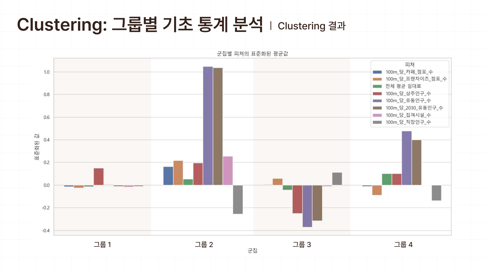
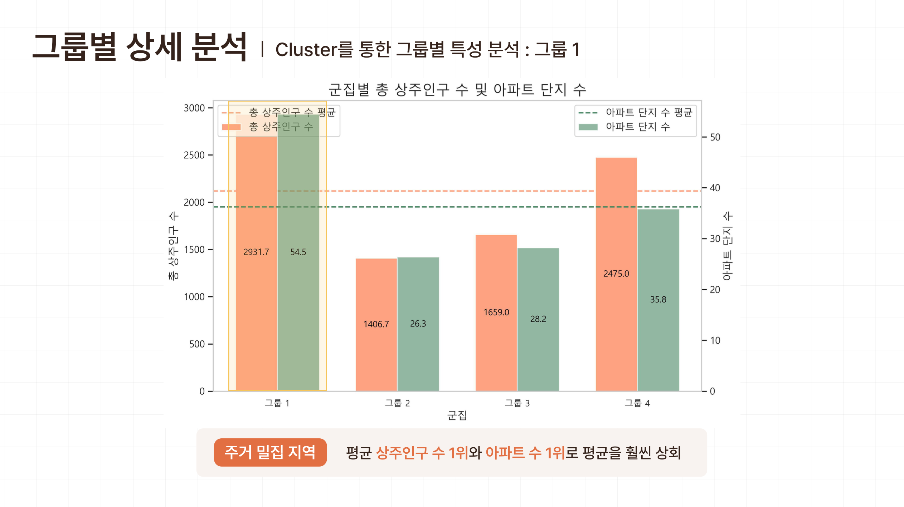
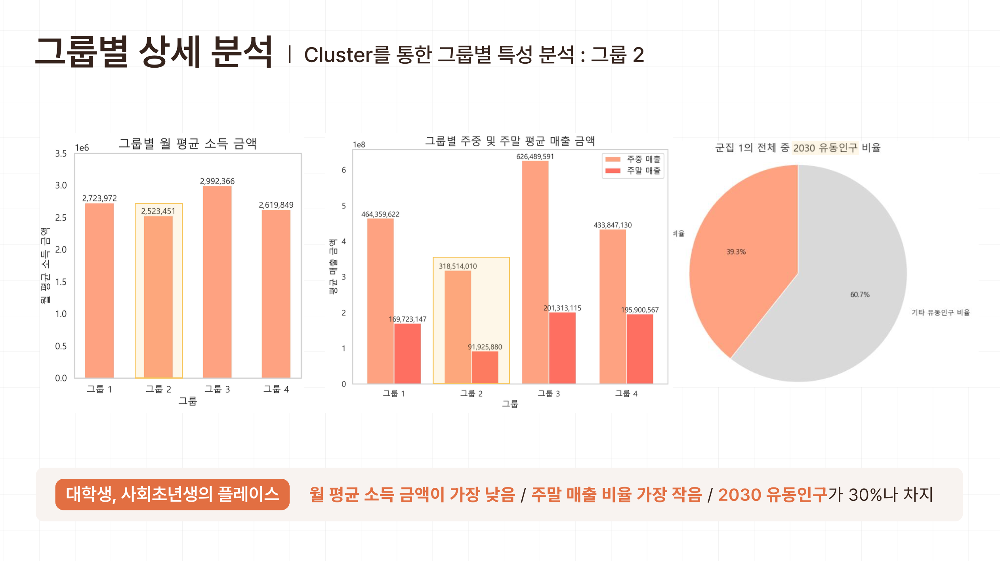
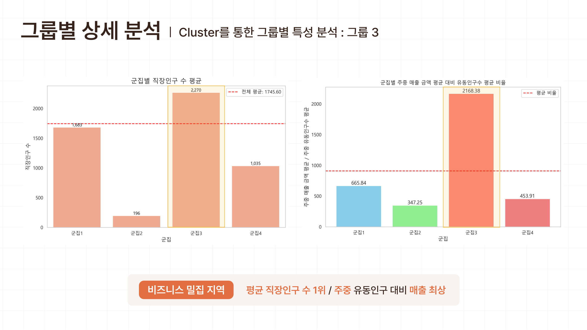
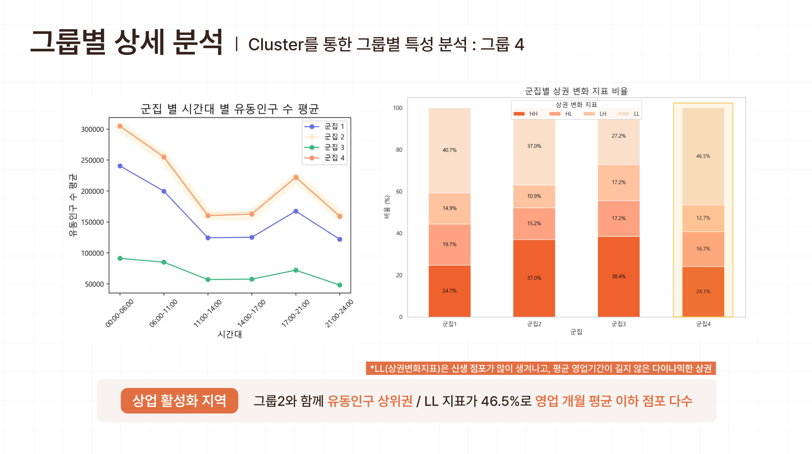
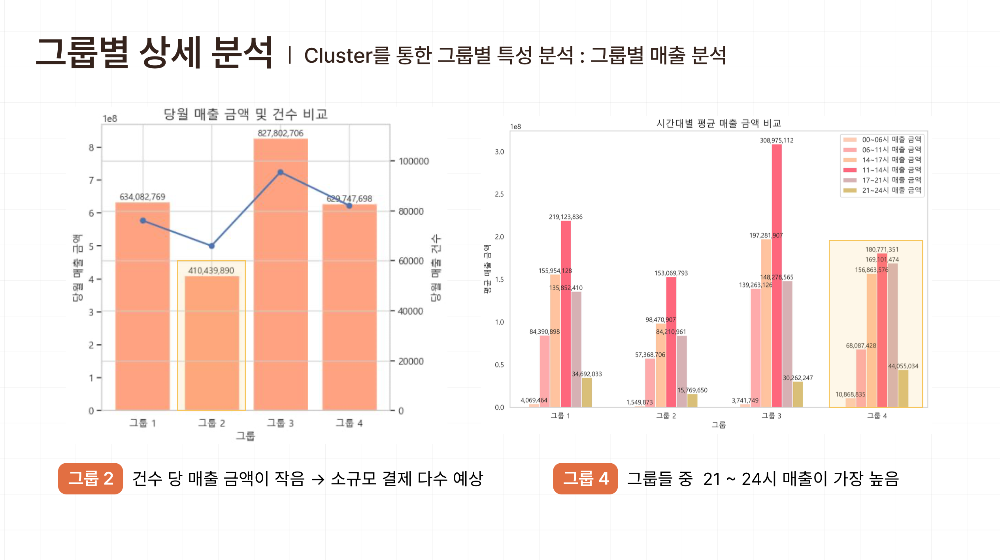
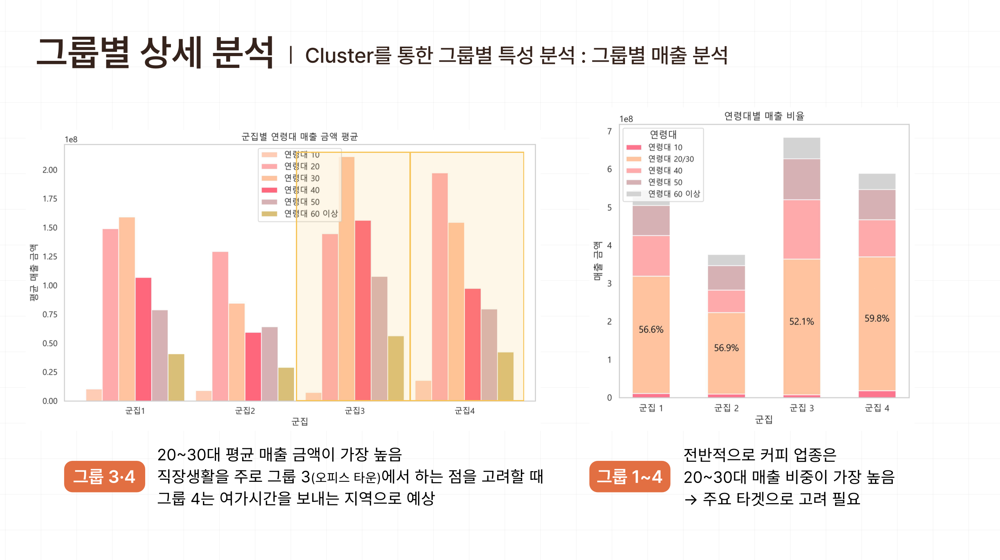
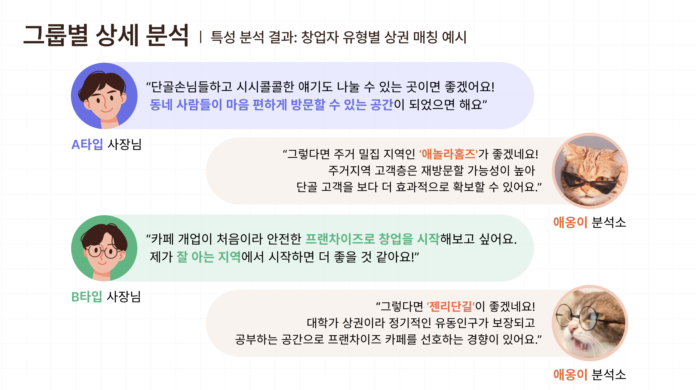

# 서울시 카페 상권 데이터 분석 프로젝트 (K-means++ 군집 분석)
### *"모두를 위한 상권은 없다! 창업자의 특성을 고려한 맞춤 상권을 추천해드립니다."*

## Outline
- 기간: 24.10.07 ~ 24.10.23 
- 팀 구성: 4인
- 수행 업무: 프로젝트 총괄 매니징, 군집 분석 및 해석, 데이터 시각화
- Tools: Python (Jupyter notebook), scikit learn, matplotlib, seaborn, folium
- 🔗 [code 바로가기](cafe.ipynb)
- 🔗 [PPT 바로가기](cafe_commercial_area.pdf)

&nbsp; 

## Summary 
### 배경 및 목표
- 커피업은 매력적이지만 이미 포화도가 높은 업종이기 때문에 철저한 상권 분석이 필수적임
- 보편화된 기준이 아닌 창업자 특성을 고려한 맞춤 입지를 추천하는 것을 목표로 함

### 데이터
- 서울시 상권 분석 서비스(서울 열린데이터 광장)
  - 영역, 점포, 상권변화지표, 직장인구, 유동인구, 상주인구, 아파트, 소득소비, 추정매출, 임대료, 집객시설 
  - 2023년 4분기, '상권' 단위 데이터 
- 한국부동산원_상업용부동산 임대동향조사_임대정보_분기별 지역별 임대료(한국부동산원)

### 데이터 분석 및 결과
**1. K-means++ 알고리즘을 활용한 상권 세그멘테이션**

**2. 그룹별 특성 분석**
   
   
   

**3. 창업자 유형별 상권 매칭**
 

### 한계 및 개선 방향
- 자치구 단위 임대료 데이터로 행정동, 상가 단위에서 세밀하게 임대료의 영향력을 고려하기 어려움
- 다른 분기의 데이터를 추가하여 매출 추이 변화 등 시계열 분석 가능

